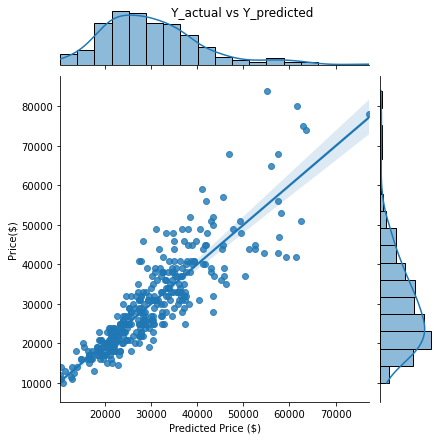

## Analysis of Used Car Data

The originally proposed concept for this project was analyzing League of Legends e-sports league data, but after spending much time scraping and analyzing the data, it was determined that depending on the approach taken there either was not enough data to meet the requirements of this project or the data points were not consistently reliable depending on when they were recorded.

As such, I am instead choosing to collect and analyze used car data (with the target being prices and the features being other associated car specifications). The data to be used for analyses was collected using carmax.com exclusively, and will be used to try to determine which features are most useful in predicting listed car price and whether or not they can be used in said price prediction.

 Here, we will be identifying two features of interest which we believe to have some moderate-to-strong correlation with the target and evaluate them using a basic linear regression fit.

 

Plotted above are unique linear regression models trained on each of the two features (where we are using the engineered feature log_mileage) individually and then plotted against their actual x and y values. The R^2 for these models are 0.229 and 0.602, respectively.

 

 When we train the model on both features, we instead come to an R^2 of 0.762 and MAE of $4205.10, and can see in the above figure (a plot of the actual price values vs the predicted price values), that these features can give us a rough idea of the listed price of the car at a lower price range.
